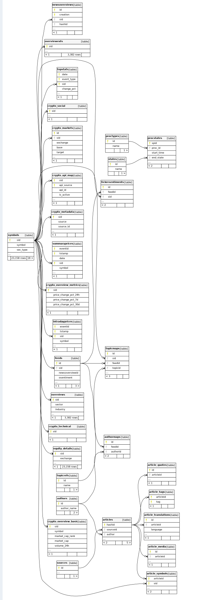

This is a re write of the original AlphaVantage rust api.  Daily updates
markdown# AlphaVantage Rust Client

A Rust implementation and complete re write of my  Rust [Alphavantage API](https://github.com/dbrowne/AlphaVantage_Rust)   client with PostgreSQL/TimescaleDB support for financial market data storage and analysis.

## ⚠️ Project Status

**This project is currently under active development. RELEASE COMING SOON!!!!**
# AlphaVantage Rust Client

[](https://github.com/dbrowne/alphavantage/actions/workflows/rust.yml)

A high-performance, async Rust client library and comprehensive data pipeline for financial market data. Built with a modular workspace architecture, it provides robust integration with AlphaVantage API, CoinGecko, and other data sources, featuring advanced caching, TimescaleDB support, and comprehensive cryptocurrency coverage.

## 🚀 Features

### Core Capabilities
- **Multi-Source Data Integration**: AlphaVantage, CoinGecko, GitHub, and more
- **Async/Await Architecture**: Built on Tokio for maximum concurrency
- **Advanced Caching System**: Response caching to minimize API calls and costs
- **TimescaleDB Integration**: Optimized time-series data storage with hypertables
- **Comprehensive Crypto Support**: Enhanced metadata, social metrics, and market data
- **Process Tracking**: ETL monitoring with automatic retry mechanisms
- **Rate Limiting**: Intelligent rate limiting based on API tier

### Data Coverage
- **Equities**: Stocks, ETFs with company fundamentals
- **Cryptocurrency**: 10,000+ coins with enhanced metadata from multiple sources
- **News & Sentiment**: NLP-powered sentiment analysis with topic categorization
- **Market Analytics**: Top gainers/losers tracking (in development)

### Currently Implemented
- ✅ Symbol loading and persistence for equities, bonds, and mutual funds
- ✅ Database schema with TimescaleDB support
- ✅ AlphaVantage API client endpoints 
- ✅ Basic project structure and workspace organization
- ✅ Data loaders for equity price data
- ✅ Data loaders for fundamentals, news, crypto
- ✅ Data loaders for price data
- ✅ CLI commands for data fetching and analysis
- ✅ AlphaVantage API client endpoints for equity market price data

### In Development
- 🚧 CoinGecko  and Coinmarketcap API client endpoints
- 🚧 Full integration between API client and database
- 🚧 Corporate actions

## Overview

This project aims to provide a complete solution for fetching, storing, and analyzing financial market data from AlphaVantage and Coingecko. Built with Rust's async ecosystem, it will offer high-performance data loading capabilities with proper rate limiting, concurrent processing, and comprehensive error handling.


## Security advisories for dependencies as of Nov 23 2025:
- [RUSTSEC-2025-0047](https://rustsec.org/advisories/RUSTSEC-2025-0047)  slab: Out-of-bounds access in get_disjoint_mut due to incorrect bounds check
- [RUSTSEC-2024-0375](https://rustsec.org/advisories/RUSTSEC-2024-0375)  atty is **UNMAINTAINED**
- [RUSTSEC-2021-0141](https://rustsec.org/advisories/RUSTSEC-2021-0141)  dotenv is **UNMAINTAINED**
- [RUSTSEC-2025-0119](https://rustsec.org/advisories/RUSTSEC-2025-0119)  number_prefix is **UNMAINTAINED**
## 📦 Project Structure

```
alphavantage/
├── crates/
│   ├── av-core/              # Core types, traits, and configuration
│   ├── av-client/            # AlphaVantage API client
│   ├── av-models/            # Data models for API responses
│   ├── av-database/          # Database integration layer
│   │   └── postgres/         # PostgreSQL/TimescaleDB implementation
│   ├── av-loaders/           # Advanced data loading functionality
│   │   └── crypto/           # Cryptocurrency-specific loaders
│   └── av-cli/               # Command-line interface
├── migrations/               # Database migrations
├── timescale_setup/          # TimescaleDB Docker setup
├── tests/                    # Integration tests
└── data/                     # CSV data files for symbol imports
```

## 🗄️  Database Schema

## Database Schema

The project includes a comprehensive PostgreSQL schema with TimescaleDB extensions:

### Core Tables
- **symbols** - Master security data with exchange information (stocks, ETFs, crypto)
- **overviews** - Company fundamentals and metrics
- **overviewexts** - Extended company information
- **equity_details** - Additional equity-specific information
- **intradayprices** - High-frequency price data (schema defined, not yet populated)
- **summaryprices** - Daily OHLCV data (schema defined, not yet populated)
- **topstats** - Market movers tracking (schema defined, not yet populated)

### Cryptocurrency Tables
- **crypto_api_map** - Mapping between symbols and external API identifiers
- **crypto_metadata** - Core cryptocurrency metadata
- **crypto_overview_basic** - Basic crypto information
- **crypto_overview_metrics** - Detailed crypto metrics
- **crypto_technical** - Technical indicators and blockchain metrics
- **crypto_social** - Social media metrics and community data
- **crypto_markets** - Exchange and market pair information

### News & Sentiment
- **newsoverviews** - Article metadata with sentiment scores
- **feeds** - Individual news feeds
- **articles** - Article content and details
- **article_media** - Media attachments for articles
- **article_quotes** - Quoted text from articles
- **article_symbols** - Symbol mentions in articles
- **article_tags** - Article categorization tags
- **article_translations** - Multi-language article support
- **sources** - News sources
- **authors** - Article authors
- **authormaps** - Author-article relationships
- **tickersentiments** - Ticker-specific sentiment analysis
- **topicmaps** - Topic-symbol relationships
- **topicrefs** - Topic reference data

### System Tables
- **api_response_cache** - Response caching for API efficiency
- **procstates** - ETL process state tracking
- **proctypes** - Process type definitions
- **states** - Process state definitions
- **__diesel_schema_migrations** - Database migration tracking

### Phase 2: Data Loaders
- Company overview loader ✅
- Crypto currency symbol loader ✅
- Crypto Overview loader ✅
- News loader with sentiment analysis ✅
- Price data loaders ✅
- Batch processing with progress tracking 🚧


 
### Phase 3: API Client (In Progress)
- 🚧 Time series endpoints
- 🚧 Fundamental data endpoints
- ✅ News sentiment endpoints
- 🚧 Rate limiting implementation


### Phase 4: CLI Enhancement
- Complete command structure 🚧
- Query capabilities
- Analytics commands
- Process management


### Phase 5: Production Features
- Comprehensive error handling
- Retry logic
- ✅ Caching layer


## Getting Started

### Prerequisites

- Rust 1.70+
- Docker & Docker Compose
- PostgreSQL client tools
- AlphaVantage API key ([get one here](https://www.alphavantage.co/support/#api-key))

### Installation

1. **Clone the repository:**
   ```bash
   git clone https://github.com/dbrowne/alphavantage.git
   cd alphavantage
   
2. **setup docker**
    ```bash
   cd timescale_setup
   make up
   
3. **setup database**
      ```bash
      cd ../crates/av-database/postgres
      diesel setup
      diesel migration generate base_tables
      cp base_migration/* migrations/20*base_tables
      diesel migration run
`      PGPASSWORD=dev_pw psql -U ts_user -h localhost -p 6433 -d sec_master
`      
4. **check database**
```
   psql (16.8 (Ubuntu 16.8-0ubuntu0.24.04.1), server 15.13)
   Type "help" for help.

sec_master=> \dt
                   List of relations
 Schema |            Name            | Type  |  Owner
--------+----------------------------+-------+---------
 public | __diesel_schema_migrations | table | ts_user
 public | api_response_cache         | table | ts_user
 public | article_media              | table | ts_user
 public | article_quotes             | table | ts_user
 public | article_symbols            | table | ts_user
 public | article_tags               | table | ts_user
 public | article_translations       | table | ts_user
 public | articles                   | table | ts_user
 public | authormaps                 | table | ts_user
 public | authors                    | table | ts_user
 public | crypto_api_map             | table | ts_user
 public | crypto_markets             | table | ts_user
 public | crypto_metadata            | table | ts_user
 public | crypto_overview_basic      | table | ts_user
 public | crypto_overview_metrics    | table | ts_user
 public | crypto_social              | table | ts_user
 public | crypto_technical           | table | ts_user
 public | equity_details             | table | ts_user
 public | feeds                      | table | ts_user
 public | intradayprices             | table | ts_user
 public | newsoverviews              | table | ts_user
 public | overviewexts               | table | ts_user
 public | overviews                  | table | ts_user
 public | procstates                 | table | ts_user
 public | proctypes                  | table | ts_user
 public | sources                    | table | ts_user
 public | states                     | table | ts_user
 public | summaryprices              | table | ts_user
 public | symbols                    | table | ts_user
 public | tickersentiments           | table | ts_user
 public | topicmaps                  | table | ts_user
 public | topicrefs                  | table | ts_user
 public | topstats                   | table | ts_user
(33 rows)
```
5. **Schemaspy documentation**
```bash
   rm -rf db_relations/*;
   java -jar ~/local/bin/schemaspy-6.2.4.jar \
    -t pgsql11 \
    -dp ~/local/bin/postgresql-42.7.7.jar \
    -db sec_master \
    -host localhost \
    -port 6433 \
    -u ts_user \
    -p dev_pw \
    -o db_relations;
   ```

```bash
     google-chrome db_relations/index.html 
```
 ### DB Schema

