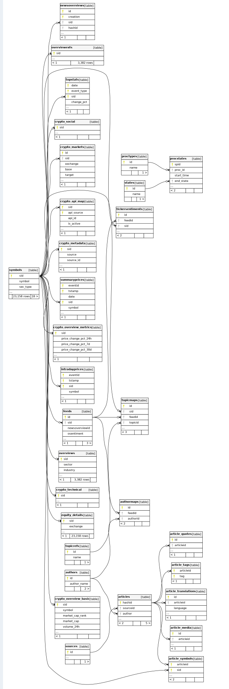

# AlphaVantage Rust Client

[](https://github.com/dbrowne/alphavantage/actions/workflows/rust.yml)

A high-performance, async Rust client library and data pipeline for financial market data. Built with a modular workspace architecture, it integrates with AlphaVantage, CoinGecko, CoinMarketCap, and other data sources, featuring TimescaleDB storage, advanced caching, and comprehensive cryptocurrency coverage.

> **Status**: Under active development.

## Features

- **Multi-source data integration** — AlphaVantage, CoinGecko, CoinMarketCap, CoinPaprika, CoinCap, SosoValue, GitHub
- **Async architecture** — Built on Tokio with full concurrency support
- **Response caching** — Minimizes API calls and costs
- **TimescaleDB** — Optimized time-series storage with hypertables
- **Comprehensive crypto** — 10,000+ coins with metadata, social metrics, and market data from multiple providers
- **ETL process tracking** — Monitoring with automatic retry mechanisms
- **Rate limiting** — Intelligent limiting based on API tier (75/min free, 600/min premium)

### Data Coverage

| Category | Details |
|----------|---------|
| Equities | Stocks, ETFs, mutual funds, bonds with company fundamentals |
| Cryptocurrency | Metadata, prices (intraday + daily), market pairs, social metrics, news |
| News & Sentiment | NLP-powered sentiment analysis with topic categorization |
| Market Analytics | Top gainers/losers tracking |

## Project Structure

```
alphavantage/
├── crates/
│   ├── av-core/              # Core types, traits, and configuration
│   ├── av-client/            # AlphaVantage API HTTP client
│   ├── av-models/            # Data models for API responses
│   ├── av-database/
│   │   └── postgres/         # PostgreSQL/TimescaleDB via Diesel ORM
│   ├── av-loaders/           # ETL data loaders (equities, news, prices)
│   ├── crypto-loaders/       # Cryptocurrency-specific loaders and providers
│   └── av-cli/               # Command-line interface (binary: av)
├── migrations/               # Database migrations
├── timescale_setup/          # TimescaleDB Docker setup
└── data/                     # CSV data files for symbol imports
```

## Crates

### av-core
Core types, traits, error handling, and configuration shared across the workspace. Includes type-safe representations for intervals, exchanges, sectors, security types, currencies, and crypto symbols with `FromStr` implementations.

### av-client
Pure async HTTP client for AlphaVantage API endpoints — time series, fundamentals, news sentiment, forex, and cryptocurrency. No database dependencies.

### av-models
Serde-based data models for all API response types.

### av-database-postgres
PostgreSQL/TimescaleDB integration via Diesel 2.3 ORM with diesel-async and BB8 connection pooling. Provides repository traits for all entity types with a unified cache layer.

### av-loaders
ETL data loaders for equities, intraday/daily prices, company overviews, news with sentiment analysis, and top market movers. Includes batch processing, CSV import, and process state tracking.

### crypto-loaders
Cryptocurrency-specific data loaders with multi-provider support:
- **Providers**: CoinGecko, CoinMarketCap, CoinPaprika, CoinCap, SosoValue
- **Loaders**: Symbol discovery, metadata, details, social metrics
- **Mapping**: Cross-provider symbol mapping and discovery service

### av-cli
Command-line interface (`av` binary) built with Clap. Commands:

```
av load securities          # Load equity symbols from CSV
av load overviews           # Load company overview data
av load intraday            # Load intraday price data
av load daily               # Load daily price data
av load news                # Load news with sentiment
av load top-movers          # Load market movers
av load crypto              # Load crypto data
av load crypto-overview     # Load crypto overviews
av load crypto-markets      # Load exchange/market pair data
av load crypto-mapping      # Load symbol mappings
av load crypto-metadata     # Load crypto metadata
av load crypto-news         # Load crypto news
av load crypto-intraday     # Load crypto intraday prices
av load crypto-details      # Load crypto details
av load crypto-prices       # Load crypto prices
av sync market              # Sync equity market data
av sync crypto              # Sync cryptocurrency data
av query symbol             # Query a specific symbol
av query list-symbols       # List all symbols
av update stats             # View database statistics
```

## Database Schema

PostgreSQL with TimescaleDB extensions. Key table groups:

**Core**: `symbols`, `overviews`, `overviewexts`, `equity_details`, `intradayprices`, `summaryprices`, `topstats`

**Cryptocurrency**: `crypto_api_map`, `crypto_metadata`, `crypto_overview_basic`, `crypto_overview_metrics`, `crypto_technical`, `crypto_social`, `crypto_markets`

**News & Sentiment**: `newsoverviews`, `feeds`, `articles`, `article_media`, `article_quotes`, `article_symbols`, `article_tags`, `article_translations`, `sources`, `authors`, `authormaps`, `tickersentiments`, `topicmaps`, `topicrefs`

**System**: `api_response_cache`, `procstates`, `proctypes`, `states`



## Getting Started

### Prerequisites

- Rust 1.92+ (edition 2021)
- Docker & Docker Compose
- PostgreSQL client tools
- AlphaVantage API key ([get one here](https://www.alphavantage.co/support/#api-key))

### Installation

1. **Clone the repository:**
   ```bash
   git clone https://github.com/dbrowne/alphavantage.git
   cd alphavantage
   ```

2. **Start TimescaleDB:**
   ```bash
   cd timescale_setup
   make up
   ```

3. **Set up the database:**
   ```bash
   cd crates/av-database/postgres
   diesel setup
   diesel migration run
   ```

4. **Configure environment:**
   ```bash
   cp DOT_env_EXAMPLE .env
   # Edit .env with your API keys and database URL
   ```

5. **Build and run:**
   ```bash
   cargo build --release
   ./target/release/av --help
   ```

### Verify database connection

```bash
PGPASSWORD=dev_pw psql -U ts_user -h localhost -p 6433 -d sec_master -c '\dt'
```

## Key Dependencies

| Crate | Version | Purpose |
|-------|---------|---------|
| tokio | 1.46 | Async runtime |
| diesel | 2.3 | ORM (PostgreSQL) |
| diesel-async | 0.8 | Async Diesel with BB8 pooling |
| reqwest | 0.12 | HTTP client |
| clap | 4.4 | CLI framework |
| serde | 1.0 | Serialization |
| chrono | 0.4 | Date/time handling |
| bigdecimal | 0.4 | Financial precision |
| tracing | 0.1 | Structured logging |
| thiserror | 2.0 | Error types |

## License

MIT